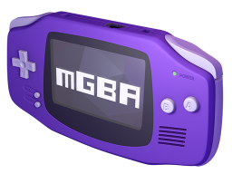

```
  _____        _         _     __         _        
 |  __ \      | |       | |   /_/        (_)       
 | |__) | ___ | |  __ _ | |_  ___   _ __  _   ___  
 |  _  / / _ \| | / _` || __|/ _ \ | '__|| | / _ \ 
 | | \ \|  __/| || (_| || |_| (_) || |   | || (_) |
 |_|  \_\\___||_| \__,_| \__|\___/ |_|   |_| \___/ 
 ```
##Engenharia de Software - 2015/2016
:floppy_disk:  *Mestrado Integrado em Engenharia Informática e Computação*   :floppy_disk:

Faculdade de Engenharia da Universidade do Porto

###Team
* Carlos Samouco (up201305187@fe.up.pt)
* Carlos Soares (up201305514@fe.up.pt)
* Diogo Marques (up201305642@fe.up.pt)

###About



**mGBA** is a new **Game Boy Advance** emulator written in C.

The project started in April 2013 with the goal of being fast enough to run on lower end hardware than other emulators support, without sacrificing accuracy or portability. Even in the initial version, games generally play without problems. It is loosely based on the previous GBA.js emulator, although very little of GBA.js can still be seen in mGBA.

Other goals include accurate enough emulation to provide a development environment for homebrew software, a good workflow for tool-assist runners, and a modern feature set for emulators that older emulators may not support.

mGBA is licensed under the **Mozilla Public License 2.0**.

###TODO:
- [x] Descrição do projeto
- [ ] Processo
- [ ] Análise critica
