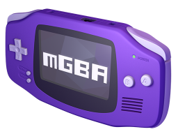

```
  _____        _         _     __         _        
 |  __ \      | |       | |   /_/        (_)       
 | |__) | ___ | |  __ _ | |_  ___   _ __  _   ___  
 |  _  / / _ \| | / _` || __|/ _ \ | '__|| | / _ \ 
 | | \ \|  __/| || (_| || |_| (_) || |   | || (_) |
 |_|  \_\\___||_| \__,_| \__|\___/ |_|   |_| \___/ 
 ```
##Engenharia de Software - 2015/2016
:floppy_disk:  *Mestrado Integrado em Engenharia Informática e Computação*   :floppy_disk:

Faculdade de Engenharia da Universidade do Porto

###Team
* Carlos Samouco (up201305187@fe.up.pt)
* Carlos Soares (up201305514@fe.up.pt)
* Diogo Marques (up201305642@fe.up.pt)

###About



**mGBA** is a new **Game Boy Advance** emulator written in C.

The project started in April 2013 with the goal of being fast enough to run on lower end hardware than other emulators support, without sacrificing accuracy or portability. Even in the initial version, games generally play without problems. It is loosely based on the previous GBA.js emulator, although very little of GBA.js can still be seen in mGBA.

Other goals include accurate enough emulation to provide a development environment for homebrew software, a good workflow for tool-assist runners, and a modern feature set for emulators that older emulators may not support.

mGBA is licensed under the **Mozilla Public License 2.0**.

mGBA é um novo emulador para Game Boy Advance implementado em C.

O projeto teve inicio em Abril de 2013 com o objetivo de correr em hardware com características inferiores às que outros emuladores supportam, sem sacrificar o rigor e a portabilidade. Mesmo numa versão inicial, os jogos corriam sem grandes problemas pois a implementação é baseada num outro projeto de um emulador para a mesma plataforma denominado GBA.js. No entanto são poucos os vestigíos encontrados relativamente ao GBA.js devido às demais alterações já realizadas.

Outros objetivos passam por adquirir uma emulação suficientemente rápida para criar um ambiente de desenvolvimento para sofware homebrew, ..., e a construção de um conjunto de recursos inovadores que possam ser utilizados por outros projetos do mesmo genero.

mGBA is licensed under the **Mozilla Public License 2.0**.

###Processo

Sendo um emulador de uma máquina virtual, a melhor forma de avaliar os progressos no código será com base em testes unitários. Estes testes tanto podem ser escritos em código para verificar o correcto funcionamento da unidade de processamento e dos restantes periféricos (dispositivos de entrada e saída, memória, vídeo) ou carregando para a aplicaçaõ um ficheiro contendo uma cópia do software original. No caso dos emuladores, estes ficheiros contendo software designam-se por ROMs, uma vez que são obtidas por processos de dumping da memória ROM contida dentro das cassetes.

Test Driven Development (TDD) é uma técnica de desenvolvimento de software que baseia em um ciclo curto de repetições <sup>1</sup>.

Como a base do *software* está relativamente sólida há algum tempo, suficiente para garantir a compatibilidade com grande parte do software concebido para a *Gameboy Advance*, nos últimos meses a equipa tem-se dedicado sobretudo ao *refactoring* do código, à correcção de pequenos *bugs* específicos encontrados durante a execução dos testes, e à implementação de novas funcionalidades na interface gráfica do utilizador, como por exemplo a opção de carregar e guardar o estado da máquina virtual num ficheiro.

No repositório existe também uma secção para *issues* bastante ativa, com utilizadores e *contributors* a submeter relatórios de *bugs* todas as semanas devidamente acompanhados por uma pequena mensagem a descrever o problema e por vezes uma imagem ou *screenshot* ilustrando a situação descrita. O *feedback* do autor deste projeto é muito responsivo, tendo a maior parte das *issues* resposta ou resolução imediata.

Além da optimização e melhoramento da estrutura do código base, a equipa está atualmente a fazer *ports* do mGBA para novas plataformas, também elas consolas de jogos (PlayStation Vita, Nintendo 3DS e Nintendo Wii).

**system testing**

###Analise Crítica

A realização de *ports* é notável para software que foi inicialmente desenhado para correr num computador com *interface* gráfica e em sistemas operativos como *Windows*, *MacOS* ou *Linux*. 

O volume de testes unitários realizados pelo *top contributor* deste projeto após cada *refactoring* ou correção de *bugs* tem sido relativamente reduzido, levando a eventuais regressões no funcionamento deste *software*. Há um número relativamente elevado de *commits* realizados com o único propósito de corrigir maus comportamentos no código.


###TODO:
- [x] Descrição do projeto
- [ ] Processo
- [ ] Análise critica
