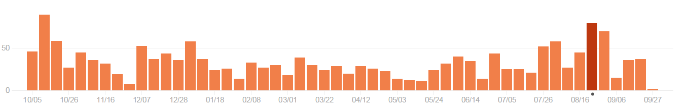
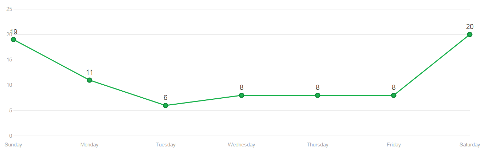
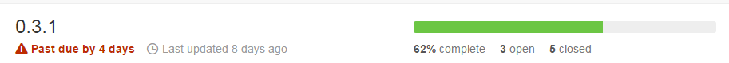

```
  _____        _         _     __         _        
 |  __ \      | |       | |   /_/        (_)       
 | |__) | ___ | |  __ _ | |_  ___   _ __  _   ___  
 |  _  / / _ \| | / _` || __|/ _ \ | '__|| | / _ \ 
 | | \ \|  __/| || (_| || |_| (_) || |   | || (_) |
 |_|  \_\\___||_| \__,_| \__|\___/ |_|   |_| \___/ 
 ```
##Engenharia de Software - 2015/2016
:floppy_disk:  *Mestrado Integrado em Engenharia Informática e Computação*   :floppy_disk:

Faculdade de Engenharia da Universidade do Porto

###Grupo
* Carlos Jorge Rocha Soares (up201305514@fe.up.pt)
* Carlos Manuel Carvalho Boavista Samouco (up201305187@fe.up.pt)
* Diogo Belarmino Coelho Marques (up201305642@fe.up.pt)

###Introdução


O [mGBA](http://mgba.io) é um emulador da consola portátil [Game Boy Advance](https://en.wikipedia.org/wiki/Game_Boy_Advance) escrito totalmente em C.

Este projeto teve inicio em Abril de 2013 com o objetivo de correr em *hardware* com características inferiores às que outros emuladores suportavam na altura, sem sacrificar a experiência do utilizador nem a portabilidade. Ainda numa versão inicial, os jogos corriam sem grandes problemas pois a implementação original era baseada num outro emulador de Game Boy Advance, também do mesmo autor, mas implementado em *JavaScript*, denominado [GBA.js](https://github.com/endrift/gbajs). No entanto, são agora poucos os vestigíos de código encontrados relativos ao antigo GBA.js devido às várias alterações realizadas pela equipa.

Outros objetivos do autor deste projeto e dos seus colaboradores passam por conseguir um emulador suficientemente rápido e capaz de correr em máquinas e dispositivos mais antigos com enorme fiabilidade, constituir um ambiente por excelência para o desenvolvimento de [*software homebrew*](https://en.wikipedia.org/wiki/Homebrew_(video_games)), uma boa ferramenta para a realização de [*tool-assisted speedruns*](https://en.wikipedia.org/wiki/Tool-assisted_speedrun) (TAS), bem como a construção de um conjunto de recursos inovadores que possam ser reaproveitados por outros projetos do mesmo género.

O mGBA integra também um projeto maior, igualmente *open-source*, a biblioteca [libretro](https://github.com/libretro), que reúne os esforços de vários *developers open-source* na comunidade de *retro gaming* para a criação de uma plataforma *cross-platform* que consiga correr *software* e jogos *retro* em máquinas mais modernas. Qualquer autor de *software* deste tipo é convidado a participar no projeto libretro, desde que disponiblize o seu código na Internet.

A versão estável do mGBA à data da elaboração deste relatório era a 0.3.0, com o lançamento da 0.3.1 previsto para breve. É esperado ainda um novo *milestone* no final deste ano.

###Processo de desenvolvimento

O projeto tem um único proprietário e um pequeno grupo com cerca de 12 colaboradores neste momento. É possivel que qualquer membro da comunidade GitHub contribua para o projeto. As instruções de contribuição estão definidas no documento CONTRIBUTING.md, disponibilizado pelo autor na raiz do repositório, sendo apenas necessário ao utilizador que tenha em atenção alguns aspetos e cuidados descritos no mesmo.

O utilizador com a intenção de contribuir deverá fazer um *fork* ou um *branch* do repositório na sua versão atual, e após realizar alterações significantes no código, pedir ao proprietário que as incorpore no *branch* principal, através de um *pull request*. No momento do *pull request* será também necessário indicar qual a finalidade daquele código, ou seja, qual o componente que foi implementado ou melhorado, bem como um parágrafo sucinto onde explique essas alterações.

Estas alterações submetidas serão apenas aceites se o código estiver devidamente formatado e organizado segundo uma determinada nomenclatura e estilo de código que devem ser obedecidos (também definidas pelo proprietário no documento). As alterações devem também ser pertinentes e não causar problemas ou regressões no funcionamento do programa, estando sujeias portanto a uma análise pelo proprietário antes de serem aprovadas.

Embora não tenha sido possível identificar um processo de desenvolvimento bem definido, a avaliação da qualidade do código e dos progressos feitos é realizada com base em testes unitários ([Test-Driven Development](https://en.wikipedia.org/wiki/Test-driven_development)) recorrendo a alguma tentativa e erro, quando há que fazer suposições quanto ao funcionamento do *hardware* na falta da respetiva documentação. Estes testes tanto podem ser escritos em código (testes manuais, por exemplo, na forma de *asserts*) para verificar o correcto funcionamento de um determinado componente de *hardware* existente na máquina virtual, como por exemplo a unidade de processamento ou um dispositivos de entrada, ou carregando para a aplicação ficheiros contendo cópias do software original com a finalidade de realizar uma espécie de teste de jogabilidade (no contexto dos emuladores, estes ficheiros contendo software designam-se por "ROMs"). Pequenas falhas no código do emulador podem criar erros gráficos visíveis ou por vezes impossibilitar o utilizador de fazer progressos no jogo.



No momento de escrita desta secção do relatório, o projeto encontrava-se relativamente ativo, com uma média de 33.3 *commits* por semana, num período de 1 ano que se estende desde a semana com início a 12 de outubro de 2014 até à semana com início a 27 de setembro de 2015, contando com mais de 2850 commits durante o seu tempo de vida. Na presente semana verificou-se também um mínimo histórico dos últimos 12 meses de 5 *commits* numa semana, segundo as estatísticas fornecidas pelo próprio GitHub.

Além da optimização e organização da estrutura do código base, a equipa está atualmente a fazer *ports* do mGBA para novas plataformas, também elas consolas de jogos ([PlayStation Portable](https://en.wikipedia.org/wiki/PlayStation_Portable), [PlayStation Vita](https://en.wikipedia.org/wiki/PlayStation_Vita), [Nintendo 3DS](https://en.wikipedia.org/wiki/Nintendo_3DS) e [Nintendo Wii](https://en.wikipedia.org/wiki/Nintendo_Wii)), com base no *feedback* recebido pela comunidade o GitHub e na página oficial do projeto no [Bugzilla](https://endrift.com/mgba/bugs/). Os responsáveis por estes *ports* criam *branches* no repositório para poder haver algum paralelismo entre o *master* que contém o código base.

###Analise Crítica

####Commits

O projeto encontra-se ativo, tendo recebido alguns *commits* ao longo do último mês. A frequência dos commits parece normal para um projeto desta dimensão que nasceu de um outro projeto já maduro. Como grande parte destes *commits* são realizados tanto ao fim-de-semana como durante a noite, tudo indica que este projeto seja um pequeno *hobby* do seu proprietário, sendo este o único projeto seu ao qual se tem dedicado nos últimos meses.



Acreditamos ainda que este projeto apresenta uma grande margem de evolução e expansão, continuando a despertar o interesse dos utilizadores e entusiastas do *retro-gaming*. Como a base do mGBA está relativamente sólida há algum tempo, tempo este suficiente para garantir a compatibilidade com a maioria dos jogos e *software* comercial lançados para a *Gameboy Advance*, nos últimos meses a equipa tem-se dedicado sobretudo ao *refactoring* do código, procurando melhorias no desempenho geral do programa; à correcção de pequenos *bugs* específicos encontrados durante a execução dos testes de jogabilidade em certos jogos, à implementação de novas funcionalidades na interface gráfica do utilizador, e aos *ports* para outras plataformas. No geral, a maioria dos commmits realizados contribuiu positivamente para um aumento global da qualidade do projeto.

####Issues

No repositório existe também uma secção de *issues* bastante ativa, com utilizadores e *contributors* a submeter relatórios de *bugs* todas as semanas devidamente acompanhados por uma pequena mensagem a descrever o problema e por vezes uma imagem ou *screenshot* ilustrando a situação descrita. O *feedback* do autor deste projeto é bastante responsivo, tendo a maior parte dos *issues* resposta imediata.

Os *issues* são uma excelente forma de definir uma sequência de tarefas a realizar, possíveís melhorias ou correções de *bugs* a fazer que entretanto foram identificados pela comunidade. Os *issues* têm uma etiqueta associada (referente à categoria, relevância, urgência dos *bugs* encontrados, etc...) e podem ser adicionados a um *milestone*, ou seja, a um conjunto de outros *issues* e funcionalidades planeadas que deverão ser resolvidas e/ou implementadas até uma certa data definida pelo proprietário. No presente momento, 28 dos 99 issues publicados estão ainda em aberto e apenas um deles foi atribuído a um *developer*. Neste momento, e desde o inicio do projeto, foram já concluídos 4 *milestones*, todos num espaço de um ano, estando ainda dois planeados para serem lançados numa data futura. No entanto, o próximo *milestone* não foi concluído a tempo, estando no presente dia com quatro dias em atraso com apenas 62% dos *issues* resolvidos, com o último *issue* desse *milestone* resolvido há oito dias atrás.



###Conclusão

Há um número relativamente elevado de *commits* realizados com o único propósito de corrigir erros no código, o que mostra que o volume de testes unitários realizados pelo proprietário deste projeto após cada *refactoring* ou correção de *bugs* não tem sido suficiente, levando a eventuais regressões no funcionamento do *software*. 

A realização de *ports* para diversas plataformas é um aspeto a salientar para um *software* de pequena escala que foi inicialmente projetado para correr num computador com *interface* gráfica e em sistemas operativos como *Windows*, *MacOS*, *Linux* ou *FreeBSD*.
