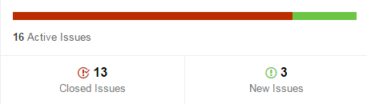
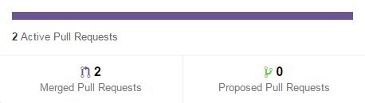

```
  _____        _         _     __         _        
 |  __ \      | |       | |   /_/        (_)       
 | |__) | ___ | |  __ _ | |_  ___   _ __  _   ___  
 |  _  / / _ \| | / _` || __|/ _ \ | '__|| | / _ \ 
 | | \ \|  __/| || (_| || |_| (_) || |   | || (_) |
 |_|  \_\\___||_| \__,_| \__|\___/ |_|   |_| \___/ 
 ```
##Engenharia de Software - 2015/2016
:floppy_disk:  *Mestrado Integrado em Engenharia Informática e Computação*   :floppy_disk:

Faculdade de Engenharia da Universidade do Porto

###Grupo
* Carlos Jorge Rocha Soares (up201305514@fe.up.pt)
* Carlos Manuel Carvalho Boavista Samouco (up201305187@fe.up.pt)
* Diogo Belarmino Coelho Marques (up201305642@fe.up.pt)

###Levantamento de Requisitos

Apesar de estar a ser marioritariamente desenvolvido pelo seu responsável, o projeto depende também dos seus *main contributors* que submetem *pull requests* com as suas ideias e dos seus *stakeholders*. No contexto deste projeto, os *stakeholders* representam um público alvo mais específico, com conhecimentos básicos nesta área, a comunidade de *retro gaming*, pois são sobretudo estes que contribuem para a melhoria da qualidade global do *software*.

No contexto dos emuladores como o mGBA, ter qualidade significa ser capaz de garantir a compatibilidade com a maior parte do *software* e dos periférios lançados para o dispositivo a ser emulado. São os stakeholders que vão dando conta de eventuais *bugs* na aplicação, que se mostram exigentes e insatisfeitos pelas imperfeições no resultado obtido e propõem novas funcionalidades para complementarem a sua experiência de utilização deste *software*.

Existem dois tipos de requisitos em engenharia de *software*, os quais tentamos adaptar ao projeto em estudo:

- requisitos funcionais (ou capacidades) descrevem as funcionalidades que se espera que o sistema disponibilize, de uma forma completa e consistente (expetativas do utilizador, atentendo aos propósitos para o qual o sistema foi desenvolvido) **:** funcionalidades da *interface* gráfica de utilizador, suporte a leitura de vários formatos de ficheiros e a funcionalidades não conseguidas na máquina real sem recorrer à técnicas de emulação.

- requisitos não-funcionais referem-se a aspetos não-funcionais do sistema, como restrições nas quais o sistema deve operar ou propriedades emergentes do sistema (utilidade, desempenho, suporte, escalabilidade) **:** possibilidade do produto final suportar mais do que uma plataforma ou sistema operativo, possibilidade de correr em máquinas mais antigas com especificações mais baixas, etc...

Os requisitos apresentados são marioritamente funcionais e nesta fase de desenvolvimento representam maioritariamente funcionalidades secundárias com vista a melhorem a experiência do utilizador final.

####Motivação

O principal propósito do responsável por este projeto na concretização deste projeto era a criação de um novo emulador de *Game Boy Advance* capaz de correr grande parte dos jogos e *software* desenvolvidos para a consola com a maior fiabilidade possível no maior número de plataformas.

O próprio autor definiu alguns destes objetivos e requisitos aquando o início do desenvolvimento do projeto, após uma análise por comparação com outros emuladores *open-source* e comerciais conceituados disponíveis na *Internet*, tendo a comunidade contribuido com o levantamento dos restantes e mais variados requisitos ao longo do ciclo de desenvolvimento deste *software*. Estas novas funcionalidades sugeridas pelos utilizadores estão habitualmente presentes em *software* do mesmo género. O objetivo do responsável por este projeto em aceitar essas sugestões que confere novas características que o distinguem de *software* equivalente.

####Bugs/Issues

No repositório existe uma secção de *issues* bastante ativa, com vários utilizadores e *contributors* a enviar relatórios de *bugs* com alguma frequência ou a sugerir novas funcionalidades. Após ter conhecimento dos mesmos, o gestor do projeto, com recurso ao [Bugzilla](https://endrift.com/mgba/bugs/describecomponents.cgi) (um *Bug-Tracking System*), especifica e categoriza os *bugs*, organizando-os pela componente do programa onde estão a ocorrer, permitindo uma boa organização dos problemas associados a cada componente do programa, dadas as diferentes prioridades que cada uma delas pode apresentar. Para além da prioridade atribuida a cada componente existem ainda prioridades de resolução dos *bugs* e *issues*, que definem a versão da *milestone* na qual estes serão resolvidos.

####Pull Requests

O utilizador com a intenção de contribuir com novas funcionalidades para este projeto deverá fazer um *fork* ou um *branch* do repositório na sua versão atual e pedir ao proprietário que as incorpore no *branch* principal (ou *master*) através de um *pull request*, após ter realizado alterações significativas no código. No momento do *pull request* será também necessário indicar a finalidade daquele código, ou seja, qual a componente do programa que foi implementada ou alterada bem como um parágrafo onde explique sucintamente esssas alterações.

###Casos de Utilização

Entre os requisitos e casos de utilização enunciados pelo responsável deste projeto no documento README.ME presente na raiz do repositório, destacam-se os seguintes, todos eles satisfeitos até ao momento de elaboração deste relatório:

- compatibilidade com grande parte dos periféricos (*hardware*) e jogos comerciais (*software*) da Game Boy Advance
- emulação rápida, capaz de executar em tempo real mesmo em computadores e dispositivos com características inferiores
- *ports* para outras plataformas recorrendo a *frameworks* como Qt/SDL
- suporte a *frameskipping* configurável
- suporte a *screenshots* (capturas de ecrã) e *cheat codes*
- suporte a *savestates*
- gravação de vídeos
- suporte a leitura de ficheiros nos formatos ZIP e 7Zip
- suporte a *patches* IPS, UPS e BPS
- suporte a debugging recorrendo a uma *interface* em linha de comandos

Na última *milestone* disponibilizada ao público, também já é possível correr este *software* em três novas plataformas, sendo estas Nintendo 3DS, Nintendo Wii, e PlayStation Vita.

###Especificação de Requisitos

Dado que não foi encontrado nenhum documento com a descrição dos requisitos funcionais e não funcionais do software em questão (também conhecido por *software requirements specification* ou SRS) assume-me que este não foi criado devendo-se possivelmente à pequena dimensão do projeto.

Este tipo de documento que estabelece os termos de condição entre os clientes e os desenvolvedores em relação ao que o produto final deve ou não corresponder, apesar de ser bastante importante não faria grande sentido neste tipo de projeto pois está a ser desenvolvido por colaboradores voluntários sem elevado grau de compromisso.

Neste caso, cabe ao único autor do projeto decidir o rumo que este deve tomar ao longo do seu ciclo de desenvolvimento, quais as alterações a fazer com base nas *milestones* definidas pelo próprio, tentando sempre que possível cumprir os prazos e datas limite estipulados.

###Análise e Negociação de Requisitos

A principal fonte de requisitos do mGBA são os *bug reports* e os *pull requests* existentes no repositório do GitHub. Ambos são habitualmente frequentados pelo responsável deste projeto e pelos seus *contributors* e *developers*.

Nem todos os *issues* levantados pela comunidade merecem a mesma atenção a nível de tempo e recursos. Para que uma ideia seja colocada em prática é necessária a aprovação do gestor do projeto e que pelo menos um dos *developers* aceite implementá-la, ou que a própria pessoa que teve a ideia tenha a iniciativa de a implementar, submetendo um *pull request* mais tarde.

Existe ainda um processo de análise manual feita pelo gestor do projeto, que consiste nos seguintes pontos:
- as sugestões de novas funcionalidades enviadas em texto devem acrescentar funcionalidades relevantes ao *software*
- o levantamento de *bugs* na forma de *issues* deve ser o mais [completo](https://github.com/mgba-emu/mgba/blob/master/CONTRIBUTING.md#filing-issues) possível, indicando qual a versão do *software* testada e todos os passos necessários para reproduzir o *bug*, acompanhado devidamente por imagens explicativas ou ficheiros de estado do jogo em questão
- as alterações de código submetidas pelos utilizadores não devem provocar alterações significantes no comportamento do código nem regressões nos testes de compatibilidade; será apenas aceite código devidamente formatado e organizado segundo [determinados critérios](https://github.com/mgba-emu/mgba/blob/master/CONTRIBUTING.md#coding-style) também definidos pelo autor que devem ser obedecidos

Nem todos os requisitos propostos podem ser vistos como viáveis ou relevantes no contexto do projeto, sendo os pedidos nestas situações rejeitados ou negociados de forma a adaptar às necessidades do proprietário. Tanto este como os colaboradores recorrem com frequência à secção de discussão associada a cada submissão como um meio para eventuais esclarecimentos e/ou obversações adicionais. 

###Validação de Requisitos

A validação de requisitos consiste em demonstrar que os requisitos levantados no processo de negociação com o cliente definem o sistema que este realmente deseja. Trata-se assim do processo onde se avalia a consistência dos pedidos que o cliente faz e se valida esses pedidos como forma de evitar erros de requisitos e diminuir os custos de desenvolvimento. 

No entanto, aqui verifica-se exatamente a situação contrária, como se estivéssemos perante uma inversão de papéis. No contexto do projeto em estudo, é o próprio responsável pelo projeto que decide se um dado requisito proposto por um utilizador final é relevante ou necessário para este.

Numa fase inicial, os *pull requests* e as alterações submetidas pelos utilizadores estão sujeitas a um processo automático de validação antes de serem aprovados. Após uma análise da estrutura do repositório, verificou-se que este foi configurado para utilizar a ferramenta Travis-CI na verificação de conflitos que possam surgir entre o código da versão presente no *master* e o código submetido nos *pull requests* e na realização de testes de compilação automáticos sobre o *source code* submetido, rejeitando código em conflito ou que apresente erros.

O GitHub disponibiliza ainda métodos de etiquetação dos *issues*, de forma a possibilitar a sua classificação em diferentes categorias e prioridades, contribuindo para uma maior organização das tarefas a desenvolver. Consultando a lista de *issues* dos últimos cinco meses, é possível classificá-los em três categorias diferentes: *bugs*, *minor bugs* e *enhancements*. Todos os *issues* que sejam considerados novas funcionalidades e que não corrijam ou melhorem componentes do emulador já implementados em código são habitualmemente classificados como *enhancements* (melhorias), recebendo a menor das prioridades. Os *minor bugs* são *bugs* efetivamente presentes na versão atual do *software* mas que se manifestam em poucos casos, sendo pouco frequentes ou difíceis de reproduzir num cenário típico de utilização, recebendo portanto prioridade normal. 

Finalmente, existem os *issues* classificados como *bugs* pelo autor deste projeto, que retratam casos mais severos dos *minor bugs* anteriormente referidos, podendo estar associados a *crashes* ou a comportamentos bastante erráticos do *software*, sendo que estes recebem a atenção máxima por parte da equipa de desenvolvimento. A categorização dos *issues* recorrendo a etiquetas facilita os processos de validação dos *bugs*, constribuindo para uma maior eficácia na detecção e resolução destes.

Apesar de a maioria dos requisitos propostos pelos utilizadores merecerem atenção por parte do organizador, alguns deles acabam por não ser aceites, muitas vezes devido a dificuldades ou ao tempo necessário para a sua implementação. No período compreendido entre 18 de setembro e 18 de outubro de 2015 foram recebidos 16 *issues*, tendo a equipa resolvido 13 deles no decorrer do mês. Os restantes três continuam em aberto, aguardando mais informações.



Durante o mesmo periodo de tempo o projeto recebeu apenas dois pull requests, tendo ambos sido incorporados no *branch* principal.


##Análise Crítica

Os conceitos abordados nas aulas teóricas quanto à gestão de requisitos dizem respeito a projetos de *software* comercial e não se aplicam na totalidade a um projeto comunitário sem fins lucrativos como este aqui estudado, fundamentado no *open-source*.

Consideramos que tanto a secção de *issues* como os *pull requests* do GitHub são de facto as ferramentas essenciais que têm mantido este projeto ativo e dinâmico ao longo dos últimos meses, pois é através deste contacto direto entre *developers* e utilizadores que são acrescentadas novas funcionalidades ao programa e levantados eventuais *bugs* com vista ao aprimoramento contínuo do programa. Também considerámos muito positivo a forma como o desenvolvedor se dedica a categorizar todos os *bugs* detetados por forma a manter uma boa organização interna do projeto. Um outro ponto a destacar é a preocupação que o gestor deste projeto tem em não aceitar código que não cumpra uma estrutura previamente definida, de forma a tornar o código mais organizado e mais fácil de ser tratado, evitando alterações desnecessárias e trabalho extra por parte do responsável.

No entanto, apesar de o projeto seguir uma organização que procura manter a fiabilidade do processo de desenvolvimento de software, é de notar que sendo este um projeto de média dimensão, mas com uma pequena equipa de desenvolvimento, os pedidos de novas funcionalidades e os *bugs* são na maioria das vezes controlados por um único responsável, tornando o trabalho muito pessoal e pouco colaborativo, situação que pode conduzir ao desinteresse e afastamento de eventuais programadores que queiram contribuir para a evolução deste programa.
