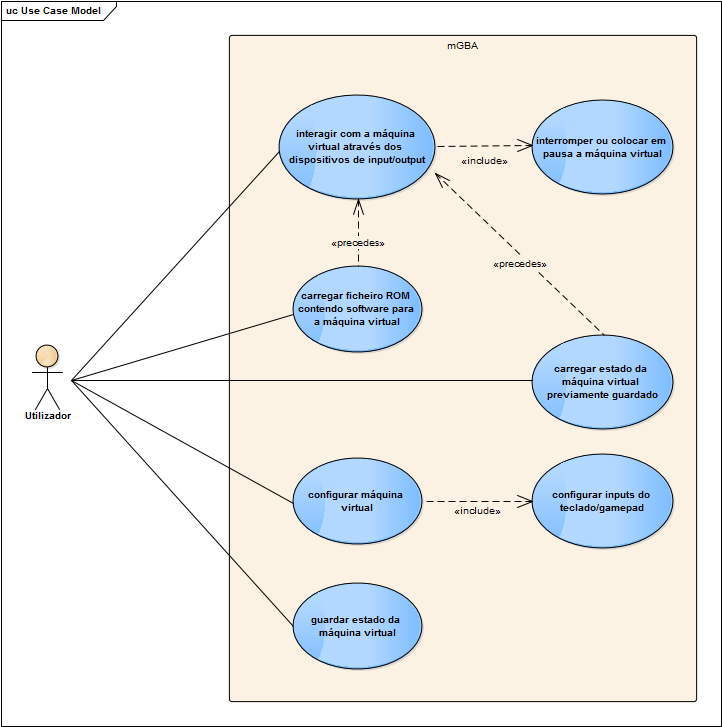
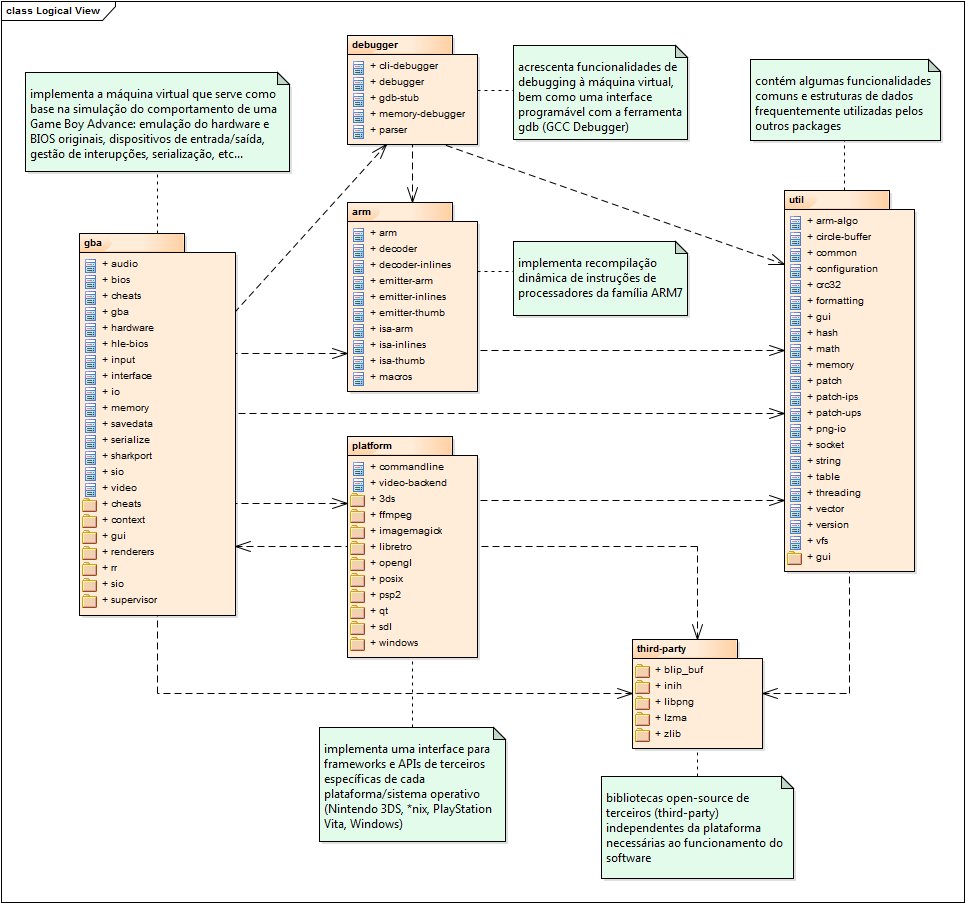
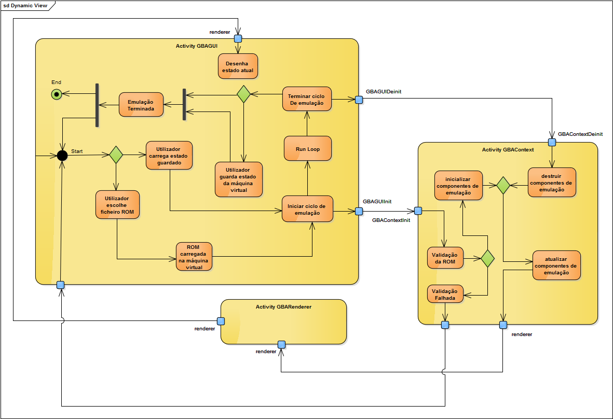
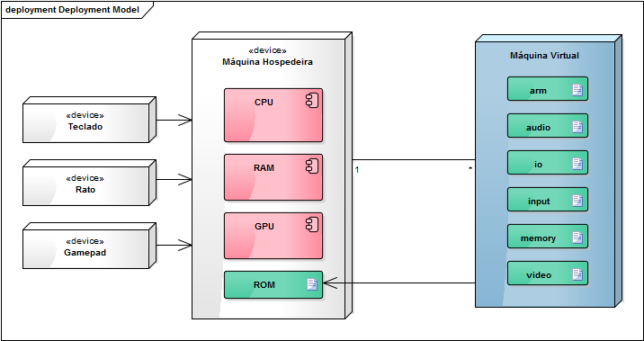

```
  _____        _         _     __         _        
 |  __ \      | |       | |   /_/        (_)       
 | |__) | ___ | |  __ _ | |_  ___   _ __  _   ___  
 |  _  / / _ \| | / _` || __|/ _ \ | '__|| | / _ \ 
 | | \ \|  __/| || (_| || |_| (_) || |   | || (_) |
 |_|  \_\\___||_| \__,_| \__|\___/ |_|   |_| \___/ 
 ```
##Engenharia de Software - 2015/2016
:floppy_disk:  *Mestrado Integrado em Engenharia Informática e Computação*   :floppy_disk:

Faculdade de Engenharia da Universidade do Porto

###Grupo
* Carlos Jorge Rocha Soares (up201305514@fe.up.pt)
* Carlos Manuel Carvalho Boavista Samouco (up201305187@fe.up.pt)
* Diogo Belarmino Coelho Marques (up201305642@fe.up.pt)

##Introdução

Neste relatório iremos abordar alguns dos conceitos associados à arquitetura do projeto em estudo segundo o **modelo de vistas 4+1**. Para o efeito foram elaborados cinco **diagramas UML**, com recurso ao *software* Enterprise Architect, para cada uma das cinco **componentes** do modelo de vistas acima referido:
- diagrama de componentes (*component diagram*), referente à vista de implementação (*implementation view*)
- diagrama de pacotes (*package diagram*), referente à vista lógica (*logical view*)
- diagrama de atividades (*activity diagram*), referente à vista de processo (*process view)*
- diagrama de distribuição (*deployment diagram*), referente à vista de distribuição (*deployment view)*
- diagrama de casos de utilização associado à vista de casos de utilização (*use-case view*)

##Use-Case View

No seguinte **diagrama de casos** de uso encontram-se esquematizadas as **sequências de interações** entre o **utilizador** e os diferentes **processos**:



Como já foi referido nos relatórios anteriores, o **mGBA** é um emulador de *Game Boy Advance* que permite ao utilizador correr em qualquer máquina moderna **software** inicialmente concebido para esta consola de jogos portátil, recorrendo a uma **máquina virtual** que simula o comportamento do *hardware* original. Os seus utilizadores não precisam de conhecer quaisquer detalhes da implementação para poder interagir com este *software* e tirar o máximo proveito da máquina virtual nele integrada.

Qualquer utilizador pode, através da interface gráfica do **mGBA** e dos periféricos de entrada e saída da sua máquina, **interagir** com a máquina virtual, ou até mesmo **controlar** a sua execução. É ainda possível ao utilizador **configurar** certos aspetos associados à comunicação entre a **máquina hospedeira** e a **máquina virtual**, ajustando-a às suas necessidades, como por exemplo definir o **mapeamento** de *inputs* virtuais da consola aos *inputs* físicos da máquina, isto é, estabelecer uma correspondência entre os botões da consola virtual e os botões do comando/teclado ou movimentos do rato realizados na máquina do utilizador.

##Logical View

No seguinte **diagrama de packages** é possível observar a separação do **sistema** em várias **componentes** de código e as **dependências** entre *packages* que caracterizam a **vista lógica** do projeto em estudo:



Após análise cuidada do código disponibilizado no repositório pelos autores deste projeto, foi possível verificar que este se encontra estruturado em seis *packages*:

O *package* **gba** é responsável pela implementação de uma **máquina virtual** na máquina hospedeira que serve como base para a **simulação** do comportamento do *hardware* original da consola *Game Boy Advance*. Entre as várias tarefas desempenhadas por esta componente do *software* destacam-se: emulação do *hardware* original e dispositivos de entrada/saída, acesso à memória, gestão de interrupções, serialização (possibilidade de carregar e guardar o estado da máquina virtual no sistema de ficheiros da máquina hospedeira).

O *package* **arm** implementa um sistema de **recompilação dinâmica** das instruções de microprocessadores da família ARM7, utilizado como unidade de processamento central da *Game Boy Advance*. Esta componente (*dynamic recompiler* ou *DynaREC*) será então responsável pela leitura do programa em código máquina desenvolvido para a *Game Boy Advance*, tradução desse código em código máquina nativo da plataforma da máquina hospedeira e por fim pela execução do código gerado na máquina hospedeira.

O *package* **plataform** implementa diversas *interfaces* para *frameworks* e APIs (*application programming interfaces*) de terceiros específicas para cada **sistema operativo** a correr nas diferentes plataformas, sendo estas:
- [Qt](http://www.qt.io/developers) **:** *cross-platform application framework that is widely used for developing application software that can be run on various software and hardware platforms com in the underlying codebase, while having the power and speed of native applications.*
- [SDL](https://www.libsdl.org) **:** *Simple DirectMedia Layer is a cross-platform development library designed to provide low level access to audio, keyboard, mouse, joystick, and graphics hardware via OpenGL and Direct3D.*

O *package* **third-party** contém bibliotecas *open source* de terceiros (*third-party libraries*) independentes da plataforma alvo que acrescentam novas funcionalidades ao sistema com o mínimo de alterações no código base, como por exemplo suporte à leitura de formatos de ficheiro menos comuns. Segue-se uma lista com as cinco bibliotecas utilizadas no projeto estudado: 
- [blip_buf](https://code.google.com/p/blip-buf/) **:** *Blip_buf is a small waveform synthesis library meant for use in classic video game sound chip emulation. It greatly simplifies sound chip emulation code by handling all the details of resampling. The emulator merely sets the input clock rate and output sample rate, adds waveforms by specifying the clock times where their amplitude changes, then reads the resulting output samples.*
- [inih](https://github.com/benhoyt/inih) **:** biblioteca minimalista e *lightweight* escrita em C para leitura de ficheiros de configuração .INI, concebida especialmente para correr em sistemas embarcados
- [libpng](http://www.libpng.org/pub/png/libpng.html) **:** biblioteca de funções destinadas à leitura, escrita e manipulação de ficheiros de imagem no formato PNG (*Portable Network Graphics*)
- [lzma](http://www.7-zip.org/sdk.html) **:** biblioteca multi-plataforma de compressão de dados baseada no algoritmo LZMA desenvolvido por *Igor Pavlov*, também conhecido como *Lempel-Ziv-Markov chain algorithm*.
- [zlib](http://www.zlib.net) **:** biblioteca multi-plataforma de compressão de dados baseada no algoritmo DEFLATE escrita por *Jean-Loup Gailly* e *Mark Adler*, muito semelhante ao popular formato ZIP

O *package* **debugger** acrescenta funcionalidades de *debugging* à máquina virtual, bem como uma *interface* programável com uma ferramenta de *debugging* externa, gdb (GCC Debugger).

O *package* **util** contém funcionalidades comuns e **estruturas de dados** frequentemente utilizadas nos outros *packages*:
- suporte a *multithreading* e *sockets*
- funções de gestão de memória
- funções de validação de CRC (*Cyclic Redundancy Check*)
- operações sobre *strings* e vetores
- tabelas de dispersão
- *buffers* circulares

##Implementation View

Um **diagrama de componentes** associado a uma **vista de implementação** representa o modo como as componentes de um sistema de *software* se relacionam entre si. Estes diagramas são utilizados com as seguintes finalidades:
- separar os dados do código fonte do código executável do software,
- destacar a função de cada módulo para facilitar a sua reutilização,
- auxiliar no processo de engenharia reversa, por meio da organização do sistema em módulos e nas relações que estabelecem entre eles.

###[imagem] !!!

A componente **GBAGUI** é responsável pela interacção principal entre o utilizador e o *software* e implementa um protótipo de *interface* gráfica com a qual o utilizador pode realizar várias operações. Integra também funções que permitem inicializar, destruir e executar uma nova instância de uma **máquina virtual** ou carregar de um estado previamente guardado, bem como um ciclo principal para atualizar o seu estado.

A componente **GBAContext** mantém o estado da máquina virtual e das partes que a constituem. Esta componente é também responsável por reencaminhar eventos dos dispositivos de entrada da máquina hospedeira para a máquina virtual e informação para os dispositivos de saída, através de uma componente **GBARenderer**, estabelecendo assim uma comunicação bidireccional entre as duas partes. O utilizador apenas pode interagir com esta componente através dos dispositivos de entrada e terminando ou colocando em pausa a execução da mesma.

A componente **GBAConfig** permite ao utilizador **configurar** a máquina virtual.

Por fim, existe uma componente **GBARenderer** que embora no código apenas seja responsável pela produção de imagem, por questões de simplificação esta componente irá englobar também a produção de som.

##Process View

Um **diagrama de atividades** ilustra um processo como um **fluxo de trabalho** por meio de uma série de ações que podem ser executadas por computadores, componentes de software ou mesmo pessoas. Os diagramas de atividades podem ser utilizados para descrever **processos** de diversos tipos e caracterizam a **vista de proceso** de um projeto, sendo eles:
- fluxos de trabalho entre um sistema e os seus utilizadores
- as etapas executadas para um caso de uso
- sequências de interações entre as componentes do *software*
- algoritmos implementados no *software*



Devido à complexidade do sistema, este diagrama descreve apenas os passos chave da emulação, desde o momento em que é iniciada pelo carregamento de um ficheiro ROM pelo utilizador até ao momento em que este decide terminar a emulação.

O **processo de emulação** do *mGBA* pode ser dividido em três actividades principais: *GBAGUI*, *GBAContext* e *GBARenderers*. A *GBAGUI* corresponde à interface gráfica que permite ao utilizador interagir visualmentecom o programa. É esta actividade que permite que o utilizador carregue o ficheiro da ROM ou um estado da máquina virtual, configure o emulador e visualize a saída gerada pelo programa. A informação gerada pelo utilizador na GUI segue depois para o *GBAContext* que se encarrega de ler e interpretar essa informação recebida e inicializar as componentes e estruturas de dados necessárias para a emulação do *hardware* da consola. Os *renderers* por questões de simplificação representam o conjunto de bibliotecas e componentes do *software* responsáveis por processar a informação de saída gerada pela máquina virtual, como por exemplo desenhar a imagem produzida pelo emulador no ecrã.

Apos inicializados, os *renderers* correm em *threads* separadas da GUI, sendo que tanto os *renderers* como a GUI permanecem em ciclo contínuo até receberem a informação de que devem terminar a emulação. Este comando de terminação pode ser gerado pelo **utilizador** a partir da interface gráfica ou pela própria máquina virtual após um situação de erro durante a sua execução. Finalizado o **ciclo de emulação** resta repor o emulador no seu **estado original**. Desta forma, a GUI pede ao *GBAContext* para destruir as variáveis de estado utilizadas durante a emulação, e este encarrega-se também de terminar os *renderers* e guardar a nova **configuração** do utilizador. Atinge-se assim o **estado final** da emulação, onde cabe ao utilizador a continuidade do ciclo, caso decida carregar uma nova ROM ou estado, ou sair da aplicação.

##Deployment View

Os **diagramas de distribuição** permitem mostrar de que modo os **artefactos** (manifestações físicas dos seus componentes de *software*) de um sistema são distribuídos em **nós** de hardware e como se relacionam com determinados componentes de *hardware*. O seguinte **diagrama de distribuição** característico de uma **vista de distribuição** ilustra de forma simplificada a relação existente entre máquina hospedeira e máquina virtual:



Existe uma **máquina hospedeira** constituída por uma unidade de processamento central, memória RAM e unidade de armazenamento, capaz de receber **inputs** de dispositivos de entrada ligados a esta (teclado, rato, *gamepad*) e produzir **output** para dispositivos de saída, como por exemplo um ecrã e dois altifalantes numa configuração típica. Existe ainda no sistema de ficheiros do disco rígido um ou vários **ficheiros ROM** (no diagrama representados como um artefacto) que contém o código do programa a ser executado na máquina virtual, bem como outros recursos adicionais necessários ao seu correto funcionamento. Estes ficheiros são carregados na aplicação pelo **utilizador** e devem apresentar um formato específico definido no código, sendo portanto validados antes da sua execução.

A **máquina hospedeira** deverá ser também capaz de executar uma ou mais **máquinas virtuais** em simultâneo, cada uma com estados distintos, com recurso a técnicas de **multiprogramação** integradas no próprio **sistema operativo**. A máquina virtual é também ela constituída por vários **artefactos** de código que simulam as diferentes componentes de *hardware* em *software*.
