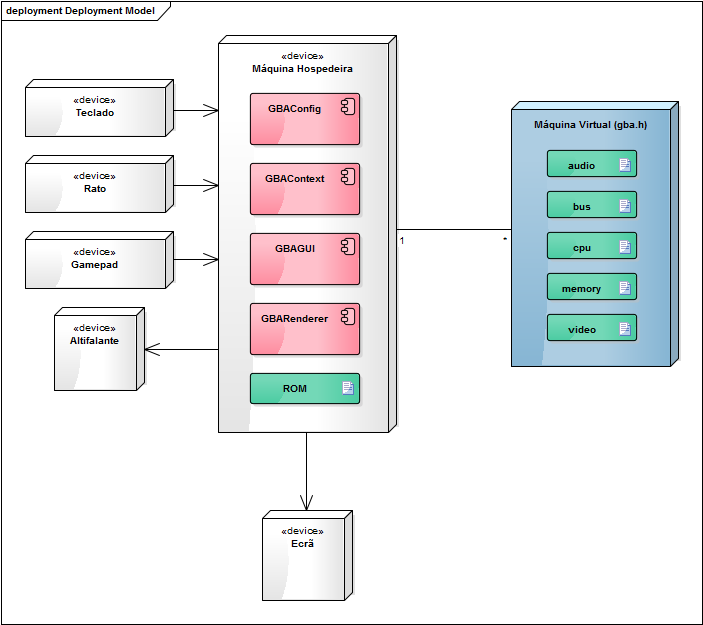

```
  _____        _         _     __         _        
 |  __ \      | |       | |   /_/        (_)       
 | |__) | ___ | |  __ _ | |_  ___   _ __  _   ___  
 |  _  / / _ \| | / _` || __|/ _ \ | '__|| | / _ \ 
 | | \ \|  __/| || (_| || |_| (_) || |   | || (_) |
 |_|  \_\\___||_| \__,_| \__|\___/ |_|   |_| \___/ 
 ```
##Engenharia de Software - 2015/2016
:floppy_disk:  *Mestrado Integrado em Engenharia Informática e Computação*   :floppy_disk:

Faculdade de Engenharia da Universidade do Porto

###Grupo
* Carlos Jorge Rocha Soares (up201305514@fe.up.pt)
* Carlos Manuel Carvalho Boavista Samouco (up201305187@fe.up.pt)
* Diogo Belarmino Coelho Marques (up201305642@fe.up.pt)

##Logical View

No seguinte diagrama de *packages* encontram-se esquematizadas a separação do sistema em várias componentes isoladas e as dependências entre *packages* que caracterizam a vista lógica do projeto em estudo.


Após análise cuidada do código disponibilizado no repositório pelos autores deste projeto, foi possível verificar que este se encontra estrutrurado em seis *packages*:

O *package* **gba** é responsável pela implementação de uma máquina virtual na máquina hospedeira que serve como base para a simulação do comportamento do *hardware* original da consola *Game Boy Advance*. Entre as várias tarefas desempenhadas por esta componente do *software* destacam-se: emulação do *hardware* original e dispositivos de entrada/saída, acesso à memória, gestão de interrupções, serialização (possibilidade de carregar e guardar o estado da máquina virtual no sistema de ficheiros da máquina hospedeira).

O *package* **arm** implementa um sistema de recompilação dinâmica das instruções de microprocessadores da família ARM7, utilizado como unidade de processamento central da *Game Boy Advance*. Esta componente (*dynamic recompiler* ou *DynaREC*) será então responsável pela leitura do programa em código máquina desenvolvido para a *Game Boy Advance*, tradução desse código em código máquina nativo da plataforma da máquina hospedeira e por fim execução do código gerado na máquina hospedeira.

O *package* **plataform** implementa diversas *interfaces* para *frameworks* e APIs (*application programming interfaces*) de terceiros específicas para cada sistema operativo a correr nas diferentes plataformas.
- [Qt](http://www.qt.io/developers) **:** cross-platform application framework that is widely used for developing application software that can be run on various software and hardware platforms with little or no change in the underlying codebase, while having the power and speed of native applications.
- [SDL](https://www.libsdl.org) **:** (Simple DirectMedia Layer) biblioteca para desenvolvimento de aplicações multiplataforma designed to provide low level access to audio, keyboard, mouse, joystick, and graphics hardware recorrendo a APIs do sistema como OpenGL e Direct3D.

O *package* **third-party** contém bibliotecas *open source* de terceiros (*third-party libraries*) independentes da plataforma alvo que acrescentam novas funcionalidades ao sistema com o mínimo de alterações no código base, como por exemplo suporte à leitura de formatos de ficheiro menos comuns. Segue-se uma lista com as cinco bibliotecas utilizadas no projeto estudado: 
- [blip_buf](https://code.google.com/p/blip-buf/) **:** *Blip_buf is a small waveform synthesis library meant for use in classic video game sound chip emulation. It greatly simplifies sound chip emulation code by handling all the details of resampling. The emulator merely sets the input clock rate and output sample rate, adds waveforms by specifying the clock times where their amplitude changes, then reads the resulting output samples.*
- [inih](https://github.com/benhoyt/inih) **:** biblioteca minimalista e *lightweight* escrita em C para leitura de ficheiros de configuração .INI, concebida especialmente para correr em sistemas embarcados
- [libpng](http://www.libpng.org/pub/png/libpng.html) **:** biblioteca de funções destinadas à leitura, escrita e manipulação de ficheiros de imagem no formato PNG (*Portable Network Graphics*)
- [lzma](http://www.7-zip.org/sdk.html) **:** biblioteca multi-plataforma de compressão de dados que implementa o algoritmo LZMA desenvolvido por *Igor Pavlov*, também conhecido como *Lempel-Ziv-Markov chain algorithm*.
- [zlib](http://www.zlib.net) **:** biblioteca multi-plataforma de compressão de dados baseada no algoritmo DEFLATE escrita por Jean-Loup Gailly e Mark Adler, muito semelhante ao popular formato ZIP

O *package* **debugger** acrescenta funcionalidades de *debugging* à máquina virtual, bem como uma *interface* programável com uma ferramenta *debugging* externa, gdb (GCC Debugger).

O *package* **util** contém funcionalidades comuns e estruturas de dados frequentemente utilizadas nos outros packages:
- suporte a *multithreading*
- suporte a *sockets*
- funções de gestão de memória
- funções de validação de CRC (*Cyclic Redundancy Check*)
- tabelas de dispersão
- *buffers* circulares
- operações sobre *strings* e vetores

##Deployment View

Os diagramas de *deployment* permitem mostrar de que modo os artefactos (manifestações físicas dos seus componentes de *software*) de um sistema são distribuídos em nós de hardware e como se relacionam com determinados componentes de hardware. O seguinte diagrama de *deployment* ilustra de forma simplificada a relação existente entre máquina hospedeira e máquina virtual.


