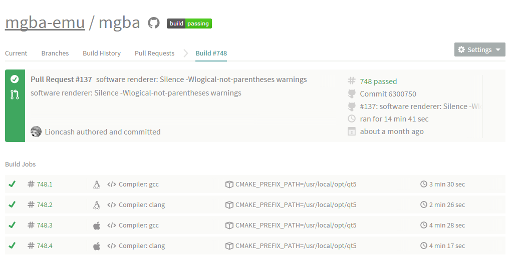

```
  _____        _         _     __         _        
 |  __ \      | |       | |   /_/        (_)       
 | |__) | ___ | |  __ _ | |_  ___   _ __  _   ___  
 |  _  / / _ \| | / _` || __|/ _ \ | '__|| | / _ \ 
 | | \ \|  __/| || (_| || |_| (_) || |   | || (_) |
 |_|  \_\\___||_| \__,_| \__|\___/ |_|   |_| \___/ 
 ```
##Engenharia de Software - 2015/2016
:floppy_disk:  *Mestrado Integrado em Engenharia Informática e Computação*   :floppy_disk:

Faculdade de Engenharia da Universidade do Porto

###Grupo
* Carlos Jorge Rocha Soares (up201305514@fe.up.pt)
* Carlos Manuel Carvalho Boavista Samouco (up201305187@fe.up.pt)
* Diogo Belarmino Coelho Marques (up201305642@fe.up.pt)

##Introdução
Neste relatório iremos analisar alguns dos conceitos associados à **validação e **verificação de software** no projeto em estudo.

Primeiramente serão estudados os graus de testabilidade do **software**, sendo estes a **controlabilidade** do estado das componentes testadas, a **observabilidade** do resultado dos testes, a isolabilidade das componentes, o grau de **separação de responsabilidades**, o grau de **inteligibilidade** das componentes e de **heterogeneidade** das tecnologias e recursos utilizados.

Em seguida pretendemos referir as circunstâncias de utilização da ferramenta Travis-CI na realização de testes de integração contínua pelo autor do projeto, bem como uma breve introdução a esta ferramenta e à forma como pode ser utilizada em conjunto com os projetos no **GitHub**.

Para terminar, iremos apresentar algumas **estatisticas de teste** referentes ao número de testes unitários realizados e resultados da execução dos mesmos, levados a cabo pelos elementos do grupo. 

##Testabilidade
Os tópicos discutidos na seguinte secção deste relatório incidirão sobre o grau de testabilidade do projeto em estudo. O grupo pretende avaliar a possibilidade de aplicação dos conhecimentos sobre processos de verificação e validação de software adquiridos nas aulas da unidade curricular de Engenharia de Software ao mesmo. Os tópicos serão acompanhados de imagens e referências a outras páginas sempre que estas forem pertinentes, com vista a ilustrar ou explicar melhor o ponto de vista dos elementos do grupo.

###Controlabilidade

A controlabilidade define o grau de controlo do estado das componentes a serem testados (*CUT - components under test*). À semelhança do que foi referido nas entregas anteriores, o **mGBA** implementa uma **máquina virtual** constituída por várias classes (aqui representadas por ficheiros de código fonte) que controlam as diferentes **componentes** de emulação do *hardware* da consola original, como por exemplo controladores de som, vídeo, *inputs* do utilizador (dispositivos de entrada tais como teclado, rato, *gamepad*), até mesmo de controladores de **execução** do CPU ou componentes para **sincronização** das próprias componentes. Tendo em conta a complexidade desta estrutura, será necessário

No que diz respeito à controlabilidade das componentes sob teste, verificámos que cada uma destas componentes fornece serviços que são independentes do estado de qualquer uma das outras componentes em cada instante da execução do programa (à exceção da unidade de controlo e sincronização), sendo portanto possível controlar o seu estado interno em cada momento. Este estado interno das diferentes componentes do programa pode ser consultado na própria **interface gráfica** da aplicação através das funcionalidades de **debugging** implementadas em código no diretório ```/src/debugger/```, conseguindo deste modo ter um maior controlo sob o *software* em execução, que permite assim demonstrar modularidade deste programa.

### Observabilidade
Não foi possível verificar a existência de testes unitários escritos expressamente em código neste repositório. Foram encontrados no entanto testes de outras naturezas no diretório ```/src/platform/test``` que demonstram em que medida essas componentes são controláveis, sendo possível definir uma série de parâmetros variáveis e instruções de execução que criam casos de teste. 

Visto que se trata de um **emulador**, seria correto afirmar que a própria utilização deste programa define um caso de teste. Com efeito, é possível realizar **testes de integração** com recurso a diferentes ficheiros ROM que são colocados a correr na **máquina virtual**, sendo posteriormente avaliado se a emulação dessa ROM teve o resultado esperado ou não. Isto acontece porque o *software* contido em cada ROM foi programado para utilizar de forma distinta os vários **recursos** da máquina virtual bem como do dispositivo a ser emulado.

Foi ainda disponibilizado pelo autor no *site* oficial do projeto uma ferramenta de testes (*test suite*) bastante completa que executa uma série de operações frequentemente realizadas pela máquina virtual, avaliando e apresentando ao utilizador os resultados obtidos:

> In the interest of furthering the state of Game Boy Advance emulation, I've been writing a test suite that tests various aspects of hardware

> -- endrift, https://forums.mgba.io/showthread.php?tid=18

Embora seja referido na página que este ficheiro ROM realiza apenas testes de *timing* ao sistema, a versão disponibilizada à data de elaboração deste relatório conta ainda com testes de acesso à memória e testes de acesso aos registos de *hardware* da máquina virtual, que se encontram exemplificados na imagem seguinte:


São frequentes os casos de ROMs nunca antes testadas gerarem exceções no programa ao pedirem certas **funcionalidades** da máquina virtual que se encontram **incompletas** ou que ainda não foram implementadas em código, o que conduz a erros de execução e a comportamentos menos previsíveis por parte do programa. Estes comportamentos são normalmente sinónimo de uma má **cobertura de código**, isto é, recursos existentes em código que raramente são testados ou utilizados. Apesar de grande parte dos utilizadores desconhecerem o funcionamento interno da máquina virtual, grande parte destas situações acabam por ser relatadas pelos mesmos na **secção de issues** do repositório, como já foi referido nas entregas anteriores. Os últimos progressos no desenvolvimento deste *software* têm sido conseguidos sobretudo graças aos testes de jogabilidade realizados pelos utilizadores.

###Isolabilidade
A maior parte das classes que fazem parte do *package* principal *gba* faz uso de algumas classes e métodos pertencentes a outros *packages*, estando estas intimamente ligadas e interdependentes, como é o caso da relação arm <=> gba. Numa situação como esta seria correto afirmar que ao testarmos uma componente de um determinado recurso do programa estamos também a testar indiretamente outras componentes presentes em diferentes módulos.

O isolamento de componentes que merece aqui destaque será a separação dos recursos dependentes e não dependentes do sistema operativo, ou seja, entre as componentes da máquina virtual e as componentes de interação do utilizador com a mesma, o que permite a realização de *ports* para outras plataformas e melhorar os aspetos gráficos da imagem, pro exemplo.

Estas dependências não são necessárias para o funcionamento normal do emulador, isto é, será possível isolar e executar a máquina virtual na sua forma mais básica (sem saída de imagem nem som) e executar testes sobre esta. O autor chega mesmo a referir no ```README.md``` que estas funcionalidades extra serão desativadas na ausência dessas dependências opcionais, e que não terá implicações no funcionamento normal da aplicação.

> mGBA has no hard dependencies, however, the following optional dependencies are required for specific features. The features will be disabled if the dependencies can't be found.

> -- endrift, https://github.com/mgba-emu/mgba/blob/master/README.md

##(TERMINAR)

###Separação de Responsabilidades
Durante o processo de desenvolvimento de *software* é importante garantir que cada funcionalidade implementada fique confinada, o mais possível, na **componente** ao qual diz respeito, evitando que o código se torne mais confuso. Um fragmento de código mal organizado ou mal atribuído conduziria ao aumento do **grau de dificuldade** na definição dos **testes unitários** a serem realizados.

Em projetos de grande dimensão como este deve ser dada uma atenção especial a estes aspetos de forma a evitar a ocorrência de código mal estruturado, o que aumentaria o custo da sua manutenção. É necessária uma separação destas funcionalidades para facilitar no isolamento da componente a ser testada, aspeto de grande relevância na produção de testes unitários relevantes e com qualidade. É com base nestes princípios que o **mGBA** se encontra estruturado em seis **packages**:

- **gba :** responsável pela implementação de uma **máquina virtual** na máquina hospedeira que serve como base para a simulação do comportamento do *hardware* original da consola **Game Boy Advance**;
- **arm :** implementa um sistema de **recompilação dinâmica** das instruções de microprocessadores da família ARM7, utilizado como unidade de processamento central da consola **Game Boy Advance**;
- **debugger :** acrescenta funcionalidades de *debugging* à máquina virtual, bem como uma *interface* programável com uma ferramenta de *debugging* externa, gdb (*GCC Debugger*);
- **platform  :** implementa diversas *interfaces* para *frameworks* e APIs (*application programming interfaces*) de terceiros específicas para cada **sistema operativo** a correr nas diferentes plataformas;
-  **third-party :** contém bibliotecas *open source* de terceiros (*third-party libraries*) independentes da plataforma alvo que acrescentam novas funcionalidades ao sistema com o mínimo de alterações no código base;
-  **util :** contém funcionalidades comuns e **estruturas** de dados frequentemente utilizadas nos outros *packages*.

###Inteligibilidade
A **inteligibilidade** do *software* assume também uma enorme relevância no que toca à manutenção, desenvolvimento e teste do *software* em questão. Assim, quanto mais detalhada for a **documentação** de um programa e melhor **organizada** for a sua estrutura, maior é a **facilidade de compreensão** do mesmo. Esta facilidade de compreensão que pode ser vista como uma vantagem nas mais variadas situações, como por exemplo na integração de **novos colaboradores**, nos relatórios de **correcção de bugs** e na sugestão de **novas funcionalidades**.

Em projetos de grandes dimensões como este, a existência de documentação e de uma **estrutura de código** bem definida possui uma importância acrescida no entendimento do funcionamento de cada componente do *software* a ser desenvolvido. É da responsabilidade do **proprietário** e dos seus colaboradores promover a consistência e qualidade do código, bem como manter a sua documentação atualizada e acessível a qualquer outro *developer* ou indivíduo que demonstre interesse em participar.

Consideramos que o projeto em estudo perde bastante nestes aspetos agora referidos, pois revela-se **pouco detalhado** na descrição das classes e das funções nelas existentes, revelando até uma completa ausência de documentação em grande parte dos ficheiros de código fonte, sendo pouco clara quando esta existia, o que torna certos módulos do programa de **difícil compreensão**. 

###Heterogeneidade
Com a constante evolução temporal do **mGBA** e o aparecimento de novas tecnologias ou paradigmas cresce também a necessidade de diversificar os métodos de teste aplicados ao *software* de modo a conseguirem abranger estas novas tecnologias implementadas. É devido ao número de bibliotecas utilizadas e funcionalidades implementadas que este projeto apresenta uma grande heterogeneidade.

Como podemos constatar pela presença de determinados ficheiros na raiz do repositório, o projeto **mGBA** utiliza várias tecnologias e bibliotecas de terceiros (*third-party*) que permitem aos colaboradores e utilizadores compilar o projeto de forma rápida e eficiente, independentemente da plataforma e dos compiladores em uso, sendo estas:

- **CMake :** família de ferramentas que têm como objetivo compilar e testar aplicações de *software*, bem como realizar configurações independentes do sistema operativo e do compilador;
- **Travis-CI :** ferramenta para realização de trstes de integração contínua *open source* distribuído de forma gratuita ao sutilizadores do GitHub.

A existência de dependências neste projeto é evidenciada pela presença de vários subdiretórios no diretório ```src/platform``` do repositório, enquanto que as informações relativas às mesmas encontram-se listadas no ficheiro README.md localizado na raiz do repositório, bem como os fins para os quais são utilizadas:

##Travis-CI
Uma das ferramentas utilizadas pelos colaboradores do projeto na realização de **testes de integração** designa-se por **Travis-CI**. Trata-se de um serviço que realiza testes de integração contínua *open source* distribuído de forma gratuita. O *Travis-CI* permite aos seus utilizadores registarem na base de dados do serviço o seu repositório do **GitHub** e assim terem os seus **testes** executados automaticamente. Sempre que é realizado um *commit* por qualquer colaborador num *branch* do repositório, esta ferramenta reconhece essa alteração, **compilando** imediatamente o projeto na sua totalidade e **correndo** todos os testes unitários **pré-configurados** num ficheiro pelo autor. O mesmo acontece com os **pull requests**, onde esta ferramenta é igualmente bastante útil, visto que auxilia os colaboradores na **validação e aprovação** dos mesmos, processo que será explorado mais adiante neste relatório.

O Travis-CI suporta diversas **linguagens de programação** e possui um grau de **dificuldade de utilização** relativamente acessível. Para configurar será apenas necessário adicionar um novo ficheiro denominado ```.travis.yml``` na raiz do repositório, bem como um conjunto de *scripts* em **linguagem Bash** que eventualmente sejam necessários para executar em paralelo com o *script* de compilação principal.

Apesar das vantagens de utilização que foram referidas nos parágrafos anteriores, os elementos do grupo, após uma análise cuidadosa do repositório do **mGBA**, concluiram que o proprietário deste projeto não tira partido máximo das funcionalidades disponibilizadas pelo **Travis-CI** aos seus utilizadores, pois não recorre a esta ferramenta para executar testes unitários sobre as alterações no código. Pelo contrário, o autor do **mGBA** serve-se apenas dela para realizar **testes de compilação** nos *pull requests* submetidos pelos colaboradores. Na raiz do repositório encontrámos ainda dois ficheiros relacionados com esta ferramenta, designados ".travis.yml" e ".travis-deps.sh".



A imagem representa as estatísticas do teste de integração realizado automaticamente pela ferramenta **Travis-CI** sobre um [*pull request*](https://github.com/mgba-emu/mgba/pull/137) publicado recentemente no repositório referente a uns *warnings* que surgiam durante a compilação numa versão específica do compilador GCC. Como foi referido no parágrafo anterior, os únicos testes de integração realizados são **testes de compilação**, recorrendo a uma pequena amostra de **dois compiladores**, *GCC* e *Clang* que são executados em **dois sistemas operativos** diferentes (Linux e Mac OS X). É possível verificar que o *pull request* em questão foi bem sucedido, tendo passado em todos os quatro testes predefinidos pelo autor de projeto.

##Gameboy Advance Test Suite 
Para uma posterior análise de cobertura de testes,  transferimos a [última versão](http://www.emucr.com/2015/11/mgba-git-20151122.html) compilada disponível na *Internet*, bem como a *suite* de testes referida nas secções anteriores, disponibilizada pelo autor. Em seguida, carregámos esse ficheiro ROM ```suite.gba``` no mGBA e executámos todos os testes disponíveis no momento (três), sendo que obtivemos os seguintes resultados:


A versão testada do programa conseguiu passar todos os **testes de memória** (1552 dos 1552 testes unitários realizados), não tendo no entanto conseguido obter pontuação máxima nos **testes de timing** (92.4%, 1164 dos 1260 casos testados com sucesso) nem nos **testes de acesso aos registos de hardware** (93.4%, 114 dos 122 casos testados com sucesso), resultados bastante satisfatórios quando comparados com os resultados obtidos por outros emuladores de **Game Boy Advance** mais antigos e portanto com processos de desenvolvimento mais longos, como se pode constatar na seguinte lista:

**Memory Tests**
- mGBA (master): 1552 *passes*
- NO$GBA 2.8b: 1394 *passes*
- VBA-M 2.0.0 beta 2: 1375 *passes*

**I/O Read Tests**
- mGBA: 114 *passes*
- NO$GBA 2.8b: 99 *passes*
- VBA-M 2.0.0 beta 2: 99 *passes*

**Timing Tests**
- mGBA: 1164 *passes*
- NO$GBA 2.8b: 759 *passes*
- VBA-M 2.0.0 beta 2: 680 *passes*

Apesar do **mGBA** ter apresentado **excelentes resultados** na execução dos testes face a programas equivalentes, estes dizem apenas respeito à componente de emulação (máquina virtual), sendo que existem outras **funcionalidades** do programa que de certa forma não foram possíveis de testar com esta ferramenta, como por exemplo a sua **interface gráfica**. Também já referimos que a *suite* de testes utilizada ainda não se encontra terminada, o próprio autor confirmou que serão **acrescentados** mais testes com o decorrer do tempo com vista a tornar esta ferramenta mais **completa**.

> At the moment, it only tests timing operations, but way more will be coming in the future. 

>-- endrift, https://forums.mgba.io/showthread.php?tid=18
